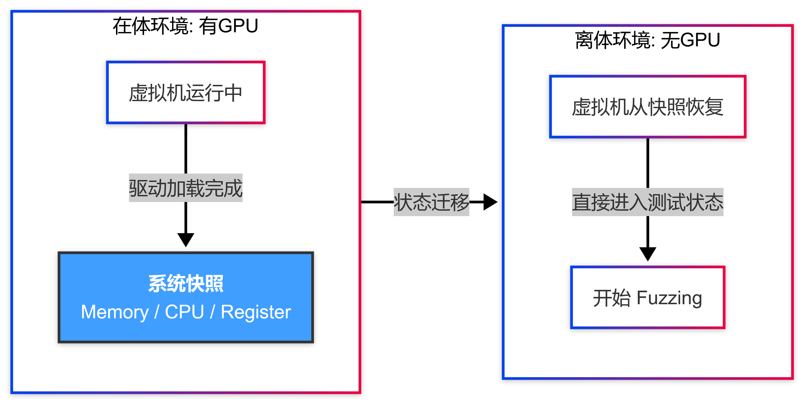
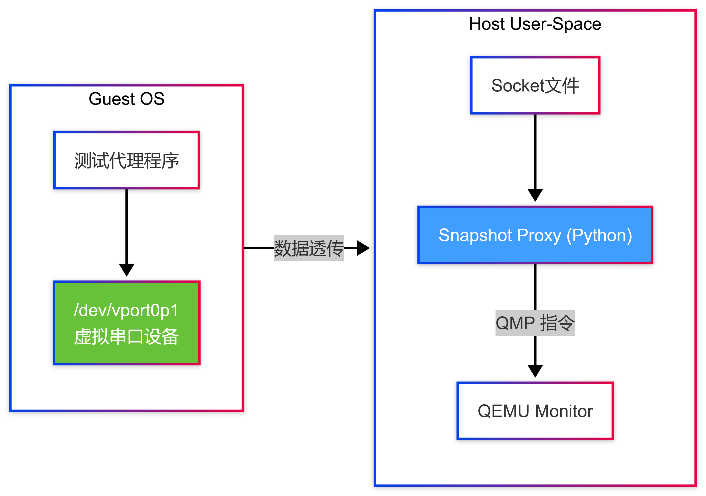

<!-- _class: title-page -->

# 基于 Moneta 的
# GPU 驱动模糊测试框架工程化重构扩展

**答辩人：陈骐**
指导教师：钮鑫涛 助理教授
专业：软件工程（智能化软件）

---

### 研究背景：GPU 驱动安全

- **核心算力底座**：
  GPU 已从图形渲染延伸至 **AI 训练**、自动驾驶、高性能计算等领域。
  - GPU 在各个领域发挥着至关重要的作用。

---

<!-- _paginate: hold -->

### 研究背景：GPU 驱动安全

- **核心算力底座**：
  GPU 已从图形渲染延伸至 **AI 训练**、自动驾驶、高性能计算等领域。
  - GPU 在各个领域发挥着至关重要的作用。
- **安全现状**：

---

<!-- _paginate: hold -->

### 研究背景：GPU 驱动安全

- **核心算力底座**：
  GPU 已从图形渲染延伸至 **AI 训练**、自动驾驶、高性能计算等领域。
  - GPU 在各个领域发挥着至关重要的作用。
- **安全现状**：
    - GPU 驱动架构**极其复杂**。

---

<!-- _paginate: hold -->

### 研究背景：GPU 驱动安全

- **核心算力底座**：
  GPU 已从图形渲染延伸至 **AI 训练**、自动驾驶、高性能计算等领域。
  - GPU 在各个领域发挥着至关重要的作用。
- **安全现状**：
    - GPU 驱动架构**极其复杂**。
    - 闭源特性（NVIDIA/AMD）导致**传统白盒测试**和**静态分析**失效。

---

<!-- _paginate: hold -->

### 研究背景：GPU 驱动安全

- **核心算力底座**：
  GPU 已从图形渲染延伸至 **AI 训练**、自动驾驶、高性能计算等领域。
- **安全现状**：
    - GPU 驱动架构**极其复杂**。
    - 闭源特性（NVIDIA/AMD）导致**传统白盒测试**和**静态分析**失效。
    - 漏洞可导致**劫持虚拟机并在宿主机上执行任意代码**

---

### 软件栈分层视图
GPU 的运行依赖于复杂的层级协作：

---

<!-- _paginate: hold -->

### 软件栈分层视图
GPU 的运行依赖于复杂的层级协作：
1. **应用层**：PyTorch / 游戏引擎。

---

<!-- _paginate: hold -->

### 软件栈分层视图
GPU 的运行依赖于复杂的层级协作：
1. **应用层**：PyTorch / 游戏引擎。
2. **用户态驱动**：封装复杂的渲染/计算指令（如 CUDA Runtime）。

---

<!-- _paginate: hold -->

### 软件栈分层视图
GPU 的运行依赖于复杂的层级协作：
1. **应用层**：PyTorch / 游戏引擎。
2. **用户态驱动**：封装复杂的渲染/计算指令（如 CUDA Runtime）。
3. **内核态驱动**：**本文研究核心**。负责权限控制、显存分配、硬件调度。

---

<!-- _paginate: hold -->

### 软件栈分层视图
GPU 的运行依赖于复杂的层级协作：
1. **应用层**：PyTorch / 游戏引擎。
2. **用户态驱动**：封装复杂的渲染/计算指令（如 CUDA Runtime）。
3. **内核态驱动**：**本文研究核心**。负责权限控制、显存分配、硬件调度。
4. **硬件层**：物理 GPU。

---

### 🧐 为什么内核态至关重要？

---

<!-- _paginate: hold -->

### 🧐 为什么内核态至关重要？

- 在内核态中，所有程序**共享内存空间**

---

<!-- _paginate: hold -->

### 🧐 为什么内核态至关重要？

- 在内核态中，所有程序**共享内存空间**
- 内核态**有权限执行任何指令**

---

### 研究现状：GPU 驱动模糊测试

对于一个不知道内部结构的黑盒系统，如何高效地发现潜在漏洞？

我们能够第一个想到的就是进行模糊测试，通过一系列**合法**的**随机输入**，让系统不断尝试各种可能的行为，从而发现潜在的漏洞和崩溃。

#

然而，<danger>和正常的模糊测试不同</danger>，GPU 驱动模糊测试面临以下挑战：

---

<!-- _paginate: hold -->

### 研究现状：GPU 驱动模糊测试

对于一个不知道内部结构的黑盒系统，如何高效地发现潜在漏洞？

我们能够第一个想到的就是进行模糊测试，通过一系列**合法**的**随机输入**，让系统不断尝试各种可能的行为，从而发现潜在的漏洞和崩溃。

#

然而，<danger>和正常的模糊测试不同</danger>，GPU 驱动模糊测试面临以下挑战：

- <warning>强硬件依赖</warning>：测试必须有物理 GPU，难以大规模扩展。

---

<!-- _paginate: hold -->

### 研究现状：GPU 驱动模糊测试

对于一个不知道内部结构的黑盒系统，如何高效地发现潜在漏洞？

我们能够第一个想到的就是进行模糊测试，通过一系列**合法**的**随机输入**，让系统不断尝试各种可能的行为，从而发现潜在的漏洞和崩溃。

#

然而，<danger>和正常的模糊测试不同</danger>，GPU 驱动模糊测试面临以下挑战：

- <warning>强硬件依赖</warning>：测试必须有物理 GPU，难以大规模扩展。
- <warning>状态难触达</warning>：闭源驱动存在复杂的异步状态机，普通 Fuzzing 难以通过浅层检查。

---

<!-- _paginate: hold -->

### 研究现状：GPU 驱动模糊测试

对于一个不知道内部结构的黑盒系统，如何高效地发现潜在漏洞？

我们能够第一个想到的就是进行模糊测试，通过一系列**合法**的**随机输入**，让系统不断尝试各种可能的行为，从而发现潜在的漏洞和崩溃。

#

然而，<danger>和正常的模糊测试不同</danger>，GPU 驱动模糊测试面临以下挑战：

- <warning>强硬件依赖</warning>：测试必须有物理 GPU，难以大规模扩展。
- <warning>状态难触达</warning>：闭源驱动存在复杂的异步状态机，普通 Fuzzing 难以通过浅层检查。

😭😭😭

---

Moneta (NDSS 2025) 提出了 **“快照重托管”** 与 **“记录重放”** 技术：

---

### 痛点：Moneta 的代码简直是纯纯的大份！

虽然理论先进，但原版 Moneta 存在严重的工程阻碍：

---

<!-- _paginate: hold -->

### 痛点：Moneta 的代码简直是纯纯的大份！

虽然理论先进，但原版 Moneta 存在严重的工程阻碍：

- <danger>内核强耦合</danger>：需要替换宿主机内核（较旧），新的机器**无法运行**，需要解决**大量的问题**

---

<!-- _paginate: hold -->

### 痛点：Moneta 的代码简直是纯纯的大份！

虽然理论先进，但原版 Moneta 存在严重的工程阻碍：

- <danger>内核强耦合</danger>：需要替换宿主机内核（较旧），新的机器**无法运行**，需要解决**大量的问题**
- <danger>构建链断层</danger>：代码仓库缺失核心 Make 目标，Syzkaller 调度器存在逻辑问题。

---

<!-- _paginate: hold -->

### 痛点：Moneta 的代码简直是纯纯的大份！

虽然理论先进，但原版 Moneta 存在严重的工程阻碍：

- <danger>内核强耦合</danger>：需要替换宿主机内核（较旧），新的机器**无法运行**，需要解决**大量的问题**
- <danger>构建链断层</danger>：代码仓库缺失核心 Make 目标，Syzkaller 调度器存在逻辑问题。
- <danger>配置僵化</danger>：硬件地址（PCI ID）和路径以及下载的 NVIDIA 驱动版本硬编码，换一台机器就需要在很多细节的地方修改代码和脚本。

---

### 重构一：非侵入式虚拟通信机制

我们先理解为什么要使用<danger>特制的宿主机内核</danger>？

---

<!-- _paginate: hold -->

### 重构一：非侵入式虚拟通信机制

我们先理解为什么要使用<danger>特制的宿主机内核</danger>？

虚拟机中的 strace 在记录过程中需要主动触发 QEMU 的快照行为，并且确认目前自己的状态是<warning>刚从快照启动</warning>，还是<success>正在拍摄快照</success>，从而决定接下来是**继续记录还是停下开始模糊测试**。

这一过程需要宿主机内核的配合，从而实现**虚拟机中的内核与 QEMU 之间**的通信。

---

<!-- _paginate: hold -->

### 重构一：非侵入式虚拟通信机制

我们先理解为什么要使用<danger>特制的宿主机内核</danger>？

虚拟机中的 strace 在记录过程中需要主动触发 QEMU 的快照行为，并且确认目前自己的状态是<warning>刚从快照启动</warning>，还是<success>正在拍摄快照</success>，从而决定接下来是**继续记录还是停下开始模糊测试**。

这一过程需要宿主机内核的配合，从而实现**虚拟机中的内核与 QEMU 之间**的通信。

🤓👆 我们能不能通过宿主机中运行的软件来达成**同样的效果**呢？

---

### Virtio-Serial 设备数据透传

---

### 重构二：自动化构建和配置项提取

既然 **Moneta** 已经按顺序写好了所有要执行的命令，那为什么不通过<warning>自动化脚本来自动运行这些命令呢</warning>？

但是在原先的按顺序执行中就已经遇到了问题：

---

<!-- _paginate: hold -->

### 重构二：自动化构建和配置项提取

既然 **Moneta** 已经按顺序写好了所有要执行的命令，那为什么不通过<warning>自动化脚本来自动运行这些命令呢</warning>？

串起来自然没问题，但是在原先的按顺序执行中就已经遇到了**问题**：

- <danger>网络波动</danger>：过程中涉及到许多从网络下载文件的操作，而根据脚本的失败即退出的特性，一旦网络波动，整个构建过程就会失败。

---

<!-- _paginate: hold -->

### 重构二：自动化构建和配置项提取

既然 **Moneta** 已经按顺序写好了所有要执行的命令，那为什么不通过<warning>自动化脚本来自动运行这些命令呢</warning>？

串起来自然没问题，但是在原先的按顺序执行中就已经遇到了**问题**：

- <danger>网络波动</danger>：过程中涉及到许多从网络下载文件的操作，而根据脚本的失败即退出的特性，一旦网络波动，整个构建过程就会失败。
- <danger>配置和命令问题</danger>：需要安装的内容并不全面，即使能够安装完成，也会因为缺少必要的编译依赖导致编译失败。

---

### 重构二：解决方案

既然找到了问题，那么**想要解决就很容易了**

---

<!-- _paginate: hold -->

### 重构二：解决方案

既然找到了问题，那么**想要解决就很容易了**

- 提取关键配置到配置文件

---

<!-- _paginate: hold -->

### 重构二：解决方案

既然找到了问题，那么**想要解决就很容易了**

- 提取关键配置到配置文件
- 当崩溃时自动重试

---

<!-- _paginate: hold -->

### 重构二：解决方案

既然找到了问题，那么**想要解决就很容易了**

- 提取关键配置到配置文件
- 当崩溃时自动重试
- 划分阶段，当某一个阶段失败时不必从头开始

---

### 重构三：Docker 化

那整个脚本已经自动化，并且已经脱离了对宿主机内核的依赖——

😕 那再套一层 `docker` 更没有什么问题吧？

至此，整个 **Moneta** 的构建过程已经完全自动化，并且已经脱离了对宿主机内核的依赖，解决了所有代码运行上的缺陷和问题，已经是一个成熟的测试框架了！

---

### 实验结果：性能与稳定性

| 评估指标 | 原版 Moneta (学术原型) | **本文重构系统 (工程化)** |
| :--- | :--- | :--- |
| **宿主机稳定性** | 几乎无法成功运行 | **长期运行无挂起** |
| **部署难度** | 需编译内核，极难复现 | **一键容器化部署** |
| **部署成功率** | ~30% (受限于内核版本) | **100% (Ubuntu 22.04+)** |

在这次研究中，我们解决了大部分 **Moneta** 的工程问题，并成功将其重构为一个完整的 GPU 驱动漏洞挖掘工具。

---

### 总结与展望

**研究总结**：
- 将一个“实验室原型”重构为完备的安全测试工具。
- 彻底解决了宿主机内核依赖问题，极大降低了 GPU 驱动漏洞挖掘的门槛。

**未来演进**：
1. **多厂商支持**：扩展至 AMD 与 Intel GPU 驱动。
2. **智能化变异**：结合 **LLM** 自动生成高语义的驱动测试语料。
3. **分布式云原生**：将 Ex-Vivo 容器部署至 K8s 集群实现大规模弹缩。

---

<!-- _class: title-page -->

# 请各位老师批评指正！
